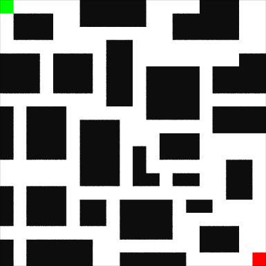
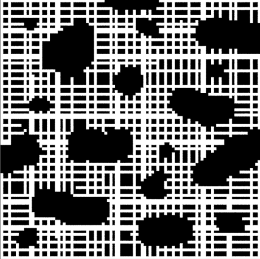
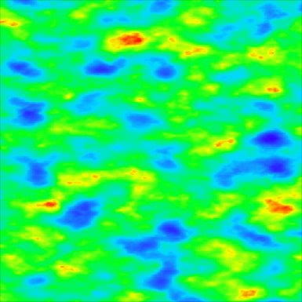
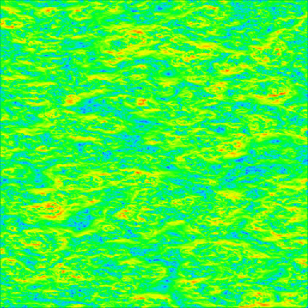

# Going on a Hike in Three Acts

# Prelude

This week we are going hiking in the wilderness! Our lovely destination is a spa in the mountains that has free food and drinks along with every streaming subscription service known. However in our excitement to depart we forgot our cell phone and do not have access to Google Maps! Oh gosh!
Luckily for us our wise co-worker has told us to always be prepared and thus we have brought along paper maps.

Our task for this week is to plot a course through three maps using path finding algorithms! There are a vareity of path finding algorithms and you are welcome to use any of your choosing, although each act does have a recommended algorithm with the intent of learning through progressing difficulty.

The internet is full of videos and articles about path finding, but a great place to review the most common algorithms is at [Red Blob Games](https://www.redblobgames.com/pathfinding/a-star/introduction.html)

# Act 1 - Leaving the City

Before we can start our hike we must first get out of the city. To do this we will hail a cab, but no cab ride is complete without sitting in the back seat second guessing the route the cabby is taking. During the ride we'll pull out our map and try to determine the shortest route through town to make sure the cab isn't taking advantage of you.

The city is a tile grid 20x20 with some impassable buildings. We'll be starting in the upper left corner, and heading to the lower lower right.

To navigate the city we'll be using the Breath First Search algorithm

## Task 1

* Path Finding Algorithm: Breadth First Search
* Grid size: 20 x 20
* Starting position: 0,0
* Ending position: 19, 19
* [act1.csv](./data/act1.csv) (0 = building, 1 = street)
 * The csv contains whether a grid tile has a building or not, ie
   Assuming the first line is - 1, 1, 0, 0, ...
   (x,y) = tile contents
   (0,0) = road
   (1,0) = road
   (2,0) = building
   (3,0) = building

## References

* [Red Blob Games: Breadth First Search](https://www.redblobgames.com/pathfinding/a-star/introduction.html#breadth-first-search)
* [Breadth First Search Algorithm | Shortest Path | Graph Theory](https://www.youtube.com/watch?v=oDqjPvD54Ss)

# Act 2 - The Suburbs

At the edge of the city the cab screeches to a halt and asks you to leave. Apparently there are juristictions for cabs here, who knew? You must now get a "suburb cab". With your new found path finding confidence you no longer want to be at the mercy of the cab driver and will instead be giving the cab directions as you go.  This act has two parts, one is to navigate the suburbs and staying on the streets. The second part is to take the speed limits into account and use that as part of the cost algorithm. Pedal to the metal!

## Task 1

Use Dijkstra’s Algorithm to find the shortest path. For this task the movement cost will be based on tile distance. Move a tile, it has a cost of 1.

* Path Finding Algorithm: Dijkstra’s Algorithm
* Grid size: 100 x 100
* Starting position: 0,0
* Ending position: 99, 99
* [act2.csv](./data/act2.csv) (0 = building, 1 = street)
 * Same type of data as Act 1, Task 1.
 * Tile values denote whether a road or building.
* Cost Function: Constant, every tile has a cost of 1.

## Task 2
Same as the previous task, but instead of using tile movement as your cost we'll use the speed limits in the provided csv file. Values are in MPH, but to use as a cost function you may want to invert them or use some other mapping. Values of 0 (no speed) means we are not on a road.

* Path Finding Algorithm: Dijkstra’s Algorithm
* Grid size: 100 x 100
* Starting position: 0,0
* Ending position: 99, 99
* [act2.csv](./data/act2.csv)  (0 = building, 1 = street)
* [act2_speeds.csv](./data/act2_speeds) (integer in MPH, 0 = not a a street)
* Cost Function: Use [act2_speeds.csv](./data/act2_speeds.csv) to derive a cost function.

## References

* [Red Blob Games: Movement Costs](https://www.redblobgames.com/pathfinding/a-star/introduction.html#dijkstra)
* [Dijkstra's Shortest Path Algorithm | Graph Theory - YouTube](https://www.youtube.com/watch?v=pSqmAO-m7Lk)

# Act 3 - The Wilderness

At last! We have made it to the wilderness and can actually begin our hike. Being exhausted from all the car travel we want to arrive at the destination as "efficently" as possible. To do so we'll be using the A\* path finding algorithm.

How you plan your hike will be up to you and you have come equiped with some various maps that may be of use including
* [Water](./data/act3_water.csv) (0 = no water, 1 = water)
* [Snow](./data/act3_snow.csv) (0 = no snow, 1 = snow)
* [Elevation](./data/act3_elevation.csv)
* [Gradient](./data/act3_gradient.csv) This value is the magnitude of the height gradient. Lower values mean relatively flat, higher values mean steep. You can use this to attempt to avoid going up steep slopes.
* [Bears](./data/act3_bears.csv) (0 = no bear, 1 = bear), You might want to stay at least two tiles away from bears.
* You may have some other maps available to you not listed here! Feel free to be creative. You can also use the elevation map to come up with fancier heuristic and cost functions like if you are going down a slope it has 0 cost because you brought skis!

### Elevation

### Gradient Magnitude

## Task 1
* Path Finding Algorithm: A\*
* Grid size: 500 x 500
* Starting position: 0,0
* Ending position: 499, 499
* Use any combination of maps or derive new data to get from the start to the destination

## References

* [The A\* algorithm](https://www.redblobgames.com/pathfinding/a-star/introduction.html#astar)
* [A\* Pathfinding (E01: algorithm explanation)](https://www.youtube.com/watch?v=-L-WgKMFuhE)

# Epilogue

